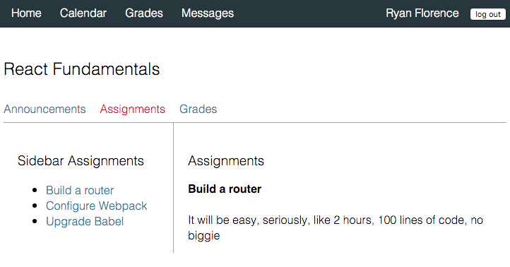

2016 Javascript Fatigue Resolution
====

Eric Clemmons blew up twitter with a well timed proposal that the react community resolve to fix [Javascript Fatigue](http://tinyurl.com/zbahygs) in 2016.

> Ultimately, the problem is that by choosing React
> (and inherently JSX), you’ve unwittingly opted
> into a confusing nest of build tools, boilerplate,
> linters, & time-sinks to deal with before you ever
> get to create anything.

## Modern React Choices

* Package Manager Choices: NPM, Bower

* Language Choices: Plain Javascript, CoffeeScript, ES5, ES6, ES2015, ES7

* Transpiler Choices: Traceur, Babel, Closure, Type-Script ...

* Building, Bundling, Script Loading: Grunt, Gulp, Browserify, Webpack, RequireJS

* Module Format Choices: AMD, CommonJS, ES6 Modules

* Productivity Options: Dev Server, Hot Reloading, Linting, OpenBrowser

* Coding Style: Filenames, Spacing, Casing, React createClass vs React.Component, ... much more

* Code Organization: Nested Folders, LIFT

* Flux Choices: Facebook's Flux, fluxxor, refluxjs, barracks, mcfly, marty, dispatchr, fetchr, fluxy, normalizr, flummox, alt, tuxx, redux

* Rendering Choices: Client Side, Isomorphic, Universal

* Styling Choices: Inline, jsxstyle, css-modules, react-jss ...

## Fatigue Solutions

### Mindfulness

Understand [The Paradox of Choice, 2004](http://www.ted.com/talks/barry_schwartz_on_the_paradox_of_choice?language=en)

> Choice is critical to freedom and autonomy. Nonetheless, we
> have have more choice than ever before but
> we don't seem to be benefiting from it psychologically.

Relax - Success doesn't depend on picking the absolute best

Embrace Opinions

### Boilerplates & Generators

Hard to find the *perfect boilerplate* and once installed can be a bit overwhelming: difficult to troubleshoot, difficult to extend & tweak.

[Boilerplate Search Engine](http://andrewhfarmer.com/starter-project/) because a good boilerplate has **everything you need** and **nothing you don't**

[The React File Generator](http://www.overreact.io/?utm_source=javascriptweekly&utm_medium=email)

### Trusted Agents

@floydophone - Pete Hunt - Worked on React at Facebook and wrote [React Howto](https://twitter.com/floydophone/status/684109201665208321) in response to Javascript Fatigue buzz.

@ryanflorence - Ryan Florence - React heavyweight who wrote ember tools and react-router

[Airbnb Style Guides](https://github.com/airbnb/javascript/tree/master/react)

[Clear, Concise, Correct Guides](https://github.com/soulmachine/react-starter-kits)


Confident Project Setup
====

Setup your project yourself using the choices of trusted agents and crisp understanding of their configuration so that you can confidently extend, tweak, and troubleshoot.

## Package Manager

NPM -vs- Bower isn't really a choice.  NPM wins and Pete Hunt says its where learning needs to begin.  You are probably already familiar with *npm install*, but you may be less aware that your new project is initialized with npm.

```
mkdir myproject
cd myproject
npm init
npm install --save react react-dom
```

## Language

Per Pete Hunt, you don't have to learn ES6 (aka ES2015) from the start, but you are going to want to pick it up as you go.  So we choose to setup our project to support ES6, but we will only adopt and use features as-needed.

## Transpiler

Babel is the clear winner in this category.  But it can be tricky because many tutorials are geared towards Babel 5.  A little history of Babel.

* Started off as 6to5

* Renamed to Babel

* Overhauled plugin system for Babel 6.0

Babel 6 changes drastically compared with Babel 5. Every transform is now a plugin, including ES2015 and JSX. Stage 0 is now a separate preset, not an option(used to be `stage: 0` in `.babelrc` in babel 5.x). So we need to install them addtionally.

	npm install --save-dev babel-core babel-preset-es2015 babel-preset-react babel-preset-stage-0

And three presets to `.babelrc`:

    "presets": ["es2015", "react", "stage-0"]

**Runtime support**

Babel can’t support all of ES6 with compilation alone — it also requires some runtime support. In particular, the new ES6 built-ins like Set, Map and Promise must be polyfilled, and Babel’s generator implementation also uses a number of runtime helpers.

    npm install --save babel-polyfill

Babel also bakes a number of smaller helpers directly into your compiled code(used to be `--external-helpers` option in Babel 5.x). This is OK for single files, but when bundling with Webpack, repeated code will result in heavier file size. It is possible to replace these helpers with calls to the `babel-runtime` package by adding the `transform-runtime` plugin:

    npm install --save babel-runtime
    npm install --save-dev babel-plugin-transform-runtime

Add the plugin to `.babelrc`:

    "plugins": ["transform-runtime"]

Reference:

+ [6.0.0 Released](http://babeljs.io/blog/2015/10/29/6.0.0/)
+ <http://babeljs.io/docs/setup/>
+ [The Six Things You Need To Know About Babel 6](http://jamesknelson.com/the-six-things-you-need-to-know-about-babel-6/)
+ [Using ES6 and ES7 in the Browser, with Babel 6 and Webpack](http://jamesknelson.com/using-es6-in-the-browser-with-babel-6-and-webpack/)

## Building & Bundling

Pete Hunt's Advice:

> For a number of good technical reasons CommonJS modules (i.e. everything in
> npm) cannot be used natively in the browser. You need a JavaScript
> “bundler” to “bundle” these modules into .js files that you can include in
> your web page with a &lt;script&gt; tag.

> Examples of JavaScript bundlers include webpack and browserify. Both are
> good choices, but I prefer webpack since it has a lot of features that make
> development of large apps easier.

Webpack - like any new build tool can be a little intimidating to learn.  These basics can get you going **very quickly** though:

For those who don't know what webpack is, please read [this tutorial](https://github.com/ruanyf/webpack-demos).

    npm install --save-dev webpack

Install essential webpack loaders(What is loader? See [official docs here](https://webpack.github.io/docs/loaders.html)):

    npm install --save-dev babel-loader css-loader style-loader url-loader

Add these loaders to `webpack.config.js`:

```javascript
module: {
  loaders: [
	{
	  test: /\.css$/,
	  include: path.resolve(__dirname, 'src'),
	  loader: 'style-loader!css-loader?modules'
	},
    {
      test: /\.jsx?$/,
	  include: path.resolve(__dirname, 'src'),
      exclude: /node_modules/,
      loader: 'babel'
    },
	{
	  test: /\.(png|jpg)$/,
      loader: 'url-loader?limit=8192'
    }
  ]
}
```

Babel requires some helper code to be run before your application. To achieve this, add the `babel-polyfill` to the `entry` section.

If you write a component in a `.jsx` file instead of `.js`, you must import or require it with the `.jsx` extension. How to import components without `.jsx` suffix? Add a `resolve` field to `webpack.config.js`:

```javascript
resolve: {
  //When requiring, you don't need to add these extensions
  extensions: ["", ".js", ".jsx"]
},
```

Finally we have a complete `webpack.config.js`:

```javascript
var webpack = require('webpack');
var path = require('path');

module.exports = {
  entry: [
    'babel-polyfill',
    path.resolve(__dirname, 'src/main.jsx')
  ],
  resolve: {
    //When requiring, you don't need to add these extensions
    extensions: ["", ".js", ".jsx"]
  },
  output: {
    path: __dirname + '/build',
    publicPath: '/',
    filename: 'bundle.js'
  },
  module: {
    loaders: [
      {
        test: /\.css$/,
        include: path.resolve(__dirname, 'src'),
        loader: 'style-loader!css-loader?modules'
      },
      {
        test: /\.jsx?$/,
        include: path.resolve(__dirname, 'src'),
        exclude: /node_modules/,
        loader: 'babel'
      },
      {
        test: /\.(png|jpg)$/,
        loader: 'url-loader?limit=8192'
      }
    ]
  }
};
```
## Productivity Options

Productivity options can either speed up your project or grind you to a hault.  Pick the good ones, quickly understand their setup and add them to your project.  Don't look back.  You need:

* webpack-dev-server

* Hot Module Replacement

* Browser Open

## Style Guides

One of the fastest ways to decrease choice and anxiety is to adopt and abide by a style guide.

[Airbnb React/JSX Style Guide](https://github.com/airbnb/javascript/tree/master/react])
 - A mostly reasonable style guide to React and JSX

* Basic Rules

* Class vs React.createClass

* Naming

* Declaration

* Alignment

* Quotes

* Spacing

* Props

* Parentheses

* Tags

* Methods

* Ordering

```
import React, { PropTypes } from 'react';

const propTypes = {
  id: PropTypes.number.isRequired,
  url: PropTypes.string.isRequired,
  text: PropTypes.string,
};

const defaultProps = {
  text: 'Hello World',
};

class Link extends React.Component {
  static methodsAreOk() {
    return true;
  }

  render() {
    return <a href={this.props.url} data-id={this.props.id}>{this.props.text}</a>
  }
}

Link.propTypes = propTypes;
Link.defaultProps = defaultProps;

export default Link;
```

Install:

    npm install --save-dev eslint babel-eslint eslint-config-airbnb eslint-plugin-react

Add `.eslintrc`:

```json
{
  "env": {
    "node": true
  },
  "ecmaFeatures": {
    "jsx": true
  },
  "globals": {
    "React": true
  },
  "plugins": [
    "react"
  ],
  "extends": "airbnb",
  "rules": {
    "comma-dangle": 0,
    "no-console": 0,
    "id-length": 0,
    "react/prop-types": 0
  }
}
```

Add `.eslintignore`:

    build/**
    node_modules/**
    **/*.css
    **/*.html

Add a subcommand `lint` to the `scripts` field of `package.json`:

    "lint": "eslint 'src/**/*.@(js|jsx)'",

Run `npm run lint` to lint all source code.

Add eslint to git pre-commit hook, this way you will never commit in code that doesn't pass a check.

    npm install --save-dev precommit-hook

In addition to the `precommit-hook` package, this command will also

+ adds two files `.jshintrc` and `.jshintignore` to current project
+ adds a `pre-commit` field to `package.json`
+ adds two subcommands `lint` and `validate` to the `scripts` field if none exist

The `lint` subcommand in `scripts` uses `eslint` instead of `jshint`, which means this starter kit doesn't use jshint at all, and this is true.

Since eslint supports ES6 while jshint only has partial support for ES6, the obvious choice is eslint.

Delete two files `.jshintrc` and `.jshintignore`:

    rm .jshint*

Reference:

+ [soulmachine/react-starter-kits](https://github.com/soulmachine/react-starter-kits/blob/master/README.md)

+ [ruanyf/react-babel-webpack-boilerplate](https://github.com/ruanyf/react-babel-webpack-boilerplate)


+ [5-step quick start guide to ESLint](http://codeutopia.net/docs/eslint/)
+ [A Comparison of JavaScript Linting Tools](http://www.sitepoint.com/comparison-javascript-linting-tools/)
+ [ruanyf/react-babel-webpack-boilerplate](https://github.com/ruanyf/react-babel-webpack-boilerplate)
+ [ruanyf/webpack-demos](https://github.com/ruanyf/webpack-demos)
+ [petehunt/webpack-howto](https://github.com/petehunt/webpack-howto)

##Folder Structure

Folder structure and application navigation and routing to me seem to be an important connection, so I asked the guy who wrote react-router and who has a lot of experience with Ember (where all these front-ends got their router inspiration).

@jrhicks: do you still recommend a react-app-file-structure like https://gist.github.com/ryanflorence/110d4538bf98694538de

@ryanflorence: absolutely, check out the &quot;huge-apps&quot; example in react router: https://github.com/rackt/react-router/tree/master/examples/huge-apps

**Views are a nested set of routes and components.**

1.  make it clear which components are reused, and which are only used in one view

2.  If a module is shared among child views, it moves into the parent's component folder. It might make its way all the way to the root component folder.

3.  Its just a big recursive structure because that's what an app is. Let's embrace it in our file system.

#### Example Huge App

The following App is from an example that ships with React Router.  This example application managers courses.  In this screenshot the user has navigated into the first course "React React Fundamentals" and is viewing the details of the first assignment "build a router".

* App has a global navigation

* A course and its nested elements share sub navigation "Announcements, Assignments, Grades"

* Assignments follow a master-detail pattern.  And the assignments sidebar is shared.



#### Components - Routes - Indexes

Views are composed of components, routes, and indexes.

```
.
├── actions
├── stores
└── views
		├── components
		├── routes
		└── index.js
```

Routes contain sub-views as shown below.  Not shown below is that each subview is itself the same arrangement of components, routes, and indexes.

```
.
├── actions
├── stores
└── views
		├── components
		├── routes
		│		├── Calendar
		│		├── Course
		│		├── Grades		
		│		├── Messages				
		│		└── Profile
		└── index.js
```

The index ties together the components and sub-views into a data structure that react-router can easily consume.

./views/index.js
```
export default {
    path: '/',
    component: require('./components/App'),
    childRoutes: [
      require('./routes/Calendar'),
      require('./routes/Course'),
      require('./routes/Grades'),
      require('./routes/Messages'),
      require('./routes/Profile')
    ]
  }
```

At the root of the application we have Global Navigation and a padded canvas where for the currently routed nested children.  If the user hasn't navigated to a nested child, we default to render the Dashboard.

.views/components/App.js
```
/*globals COURSES:true */
import React from 'react'
import Dashboard from './Dashboard'
import GlobalNav from './GlobalNav'

const App = React.createClass({
  render() {
    return (
      <div>
        <GlobalNav />
        <div style={{ padding: 20 }}>
          {this.props.children || <Dashboard courses={COURSES} />}
        </div>
      </div>
    )
  }
})

export default App
```

Review the components along the nested route:


* Course -> Announcements -> Announcement

```
.
├── actions
├── stores
├── views
│   ├── components
│   │   ├── App.js
│   │   ├── Dashboard.js
│   │   └── GlobalNav.js
│   ├── routes
│   │   └── Course
│   │       ├── components
│   │       │   ├── Course.js
│   │       │   ├── Dashboard.js
│   │       │   └── Nav.js
│   │       ├── routes
│   │       │   ├── Announcements
│   │       │   │   ├── components
│   │       │   │   │   ├── Announcements.js
│   │       │   │   │   └── Sidebar.js
│   │       │   │   ├── routes
│   │       │   │   │   └── Announcement
│   │       │   │   │       ├── components
│   │       │   │   │       │   └── Announcement.js
│   │       │   │   │       └── index.js
│   │       │   │   │   
│   │       │   │   └── index.js
│   │       │   ├── Assignments
│   │       │   └── Grades
│   │       └── index.js
│   └── index.js
├── app.js
└── index.html
```

Our application is just a div and the root index.js of the views.

./app.js
```
import React from 'react'
import { render } from 'react-dom'
import { Router, browserHistory } from 'react-router'

const rootRoute = {
  component: 'div',
  childRoutes: require('./views/index.js')
}

render(
  <Router history={browserHistory} routes={rootRoute} />,
  document.getElementById('app')
)
```

./views/index.js
```
export default {
  component: 'div',
  childRoutes: [ {
    path: '/',
    component: require('./components/App'),
    childRoutes: [
      require('./routes/Calendar'),
      require('./routes/Course'),
      require('./routes/Grades'),
      require('./routes/Messages'),
      require('./routes/Profile')
    ]
  } ]
}
```


./views/routes/Course/index.js
```
export default {
  path: 'course/:courseId',

  getChildRoutes(location, cb) {
    require.ensure([], (require) => {
      cb(null, [
        require('./routes/Announcements'),
        require('./routes/Assignments'),
        require('./routes/Grades')
      ])
    })
  },

  getComponent(location, cb) {
    require.ensure([], (require) => {
      cb(null, require('./components/Course'))
    })
  }
}
```

./components/Course.js
```

/*globals COURSES:true */
import React from 'react'
import Dashboard from './Dashboard'
import Nav from './Nav'

const styles = {}

styles.sidebar = {
  ...
}

const Contacts = React.createClass({
  render() {
    let { sidebar, main, children, params } = this.props
    let course = COURSES[params.courseId]

    let content
    if (sidebar && main) {
      content = (
        <div>
          <div className="Sidebar" style={styles.sidebar}>
            {sidebar}
          </div>
          <div className="Main" style={{ padding: 20 }}>
            {main}
          </div>
        </div>
      )
    } else if (children) {
      content = children
    } else {
      content = <Dashboard />
    }

    return (
      <div>
        <h2>{course.name}</h2>
        <Nav course={course} />
        {content}
      </div>
    )
  }
})

export default Course;
```

## Module Format

Okay.  We don't want to have to choose between AMD and [CommonJS](http://www.sitepoint.com/understanding-module-exports-exports-node-js/) so lets just [learn ES6 modules](http://exploringjs.com/es6/ch_modules.html).  No sweat, jump ahead of those that just copy and paste with an understanding of 2 basic syntaxes.

* want to export multiple things, name them

* only need to export one thing, export default

```
//------ lib.js ------
export const sqrt = Math.sqrt;
export function square(x) {
    return x * x;
}
export function diag(x, y) {
    return sqrt(square(x) + square(y));
}

//------ main.js ------
import * as lib from 'lib';
console.log(lib.square(11)); // 121
console.log(lib.diag(4, 3)); // 5

//------ main.js ------
import { square, diag } from 'lib';
console.log(square(11)); // 121
console.log(diag(4, 3)); // 5
You can also import the complete module:
```

If your browsing along and you see something like:

```
module.exports = {stuff}
```

That is CommonJS (written in ES5)  No biggie.  In ES6 its:

```
export default {stuff}
```

Use a *default* where it makes more sense for a single export.

```
For example, a function:

//------ myFunc.js ------
export default function () { ··· } // no semicolon!

//------ main1.js ------
import myFunc from 'myFunc';
myFunc();

```


Build / Bundler
=======

Per Pete Hunt's advice for many good reasons:  Webpack.

Atom
=====

Project snippets.  Reload with control-option-command-L.

Notable tweets
=====

<blockquote class="twitter-tweet" lang="en"><p lang="en" dir="ltr">I only want <a href="https://t.co/KjNLQqay1R">https://t.co/KjNLQqay1R</a> for styling a React app. Compose your styles with components. This is it for me.</p>&mdash; Ryan Florence (@ryanflorence) <a href="https://twitter.com/ryanflorence/status/684528942456279040">January 6, 2016</a></blockquote>
<script async src="//platform.twitter.com/widgets.js" charset="utf-8"></script>
