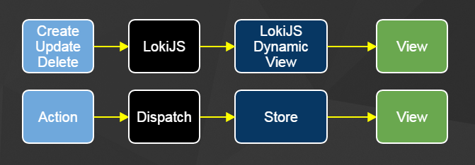

#Introduction#

There are some entertaining similarities between a LokiJS Dynamic View and a Flux Store.  In this post I introduce LokiJS Dynamic Views and demonstrate how you
could use a Flux Store to implement the same functionality.

I also show how to use Flux Stores to go beyond LokiJS and implement some capabilities LokiJS doesn't yet (but will soon) provide.  I end with some Flux-Frustrations that I think databases are uniquely capable of solving.

#Dynamic Views#

LokiJS has a feature called dynamic views that can build themselves from a collection and then very efficiently maintain themselves from updates.  As
described on LokiJS:

> The DynamicView class allows for 'live', optionally persistent views. It supports multiple 'find' and 'where' filters and a single sort criteria. Changes to documents within the collection are automatically evaluated for addition or removal from the view ...

Here is a bookView dynamic store:

```
var bookView = db.books.addDynamicView("OldBooks");
bookView.applyFind({'yearPublished':{ '$lt' : 1950 }});

// Its worth noting that bookView is an event emitter.
bookView.on('rebuild', callback);
```

#Flux Stores#

Could we implement this with a Flux Store?  Yes!

```
import alt from '../alt';
import db from '../lokidb';
import BookCollectionActions from '../Stores/BookCollectionActions';

class OldBookStore {

  constructor() {
    this.bindActions(BookCollectionActions);
    this.data = [];
  }

  rebuild(records) {
    this.data = db.books.find( (r) => r.yearPublished <1950 );
  }

  onCreate(record) {
    if (record.yearPublished < 1950) {
      this.data.append(record);
    }
  }

  onUpdate({oldRecord, newRecord}) {
    if (oldRecord.yearPublished >= 1950 && newRecord.yearPublished <= 1950) {
      this.data.append(record);
      return;
    }
    if (oldRecord.yearPublished >= 1950 && newRecord.yearPublished >= 1950) {
      return;
    }
    if (oldRecord.yearPublished < 1950 && newReocrd.yearPublished < 1950) {
      return;
    }
    if (oldRecord.yearPublished < 1950 && newReocrd.yearPublished >= 1950) {
      this.data = this.data.find( (r) r.id != newRecord.id );
      return
    }
  }

  onDelete({oldRecord}) {
    if (oldRecord.yearPublished < 1950) {
      this.data = this.data.find( (r) r.id != newRecord.id );
    }
  }

}

module.exports = alt.createStore(OldBookStore);
```

#Entertaining Similarities#

Certainly not identical, but I hope you see the analogy I'm trying to make.



#LokiJS Joins#

In [issue 106](https://github.com/techfort/LokiJS/issues/106) applyMap
function was proposed for dynamic views.  It would allow things like:

```
var bookView = books.addDynamicView('bookView');
bookView.applyMap( (b) => objectAssign(b, {author: authorsCollection.findOne({id: b.author_id})}) );
```

This doesn't exist in LokiJS, but we could make it in a FluxStore


```
import alt from '../alt';
import db from '../lokidb';
import CollectionActions from '../Stores/CollectionActions';

class BookJoinStore {

  constructor() {
    this.bindActions(CollectionActions);
    this.data = [];
  }

  reBuild() {
    this.data = db.books.data.map( (b) => {book: b, author: db.authors.findOne({id: b.authorid}) })
  }

  onCreate({collectionName, record}) {
    if (collectionName =='book') {
      data.append({book: record, author: db.authors.findOne({id: record.authorId})})
    }
    if (collectionName == 'author') {
      // It would be nice to do something efficient
      // Until then
      reBuild();
    }
  }

  onUpdate({collectionName, oldRecord, newRecord}) {
    if (collectionName =='book') {
      // It would be nice to do something efficient
      // Until then
      reBuild();
      }
    if (collectionName == 'author') {
      // It would be nice to do something efficient
      // Until then
      reBuild();
      }
  }

  onDelete({collectionName, oldRecord}) {
    if (collectionName =='book') {
      // It would be nice to do something efficient
      // Until then
      reBuild();    }
    if (collectionName == 'author') {
      // It would be nice to do something efficient
      // Until then
      reBuild()
      }
  }

}

module.exports = alt.createStore(BookJoinStore);
```

#Flux Frustrations#

Lets say I have 3 pages with 2 components each that all show, filter, and convert books in different ways.


* Do I have a store for each component?

* If I have a generic store that I can flush and reconfigure, how do I handle 2 components on the same page?

* If I create a store for each component, how can I minimize un-needed updates to stores not in use by views?

* Why can't I have less coupling?

#Database Solutions#

##Decoupling##

What if we could create the Store from within the component?  And we could do it
in a concise, declarative fashion that other people were figuring out how to keep
performant!

What would that look like?  I propose you could create and start listening to the store on the component mounting, and discard the store on unmount.

```javascript
componentWillMount() {
  this.bookView = db.books.addDynamicView("OldBooks");
  this.bookView.applyFind({'yearPublished':{ '$lt' : 1950 }});
  this.bookView.applySimpleSort({'yearPublished'});
  this.bookView.on('rebuild', this.onChange);
}

componentWillUnMount() {
  db.books.removeDynamicView("OldBooks");
}

onChange() {
  this.setState(this.bookView.data);
}
```

##Design Constraints#

Have you ever wondered what to call an action?  For example, lets
say a user double-clicks on book.  Have you ever been tempted to name an
action after the user interaction?  Like "BookActions.doubleClicked(book)"?  Something about naming the action after the user interaction instead of the domain change feels dirty and wrong.  If what you really want to happen when
the user double clicks the book is for it be added to your favorites list, then
maybe the action should be called BookActions.addToFavorites(book).

We can go a step further.  What if the only actions where create, update, and
delete?  This type of design constraint
was the subject of DHH's 2006 keynote.
In it he made a controversial but persuasive argument that if you've modeled
 your domain correctly that everything is CRUD.

So in the above example the DHH way would be to:

```
FavoritesActions.create({user: current_user.id, book: book})
```

His example (if I can remember from 9 years ago) was about
magazines and customers.  He illustrates a magazine controller
that has the only CRUD actions: Create, Read, Update, Delete.
An argument could be made that you need a "subscribe" action
to magazine that takes a customer as a parameter.  But DHH
asserts that what you really need is a subscriptions controller
that you send the action "create".

This concept was taken so far that logging into a Rails
website is implemented as /user_session/new instead of /login.

I'm certainly not suggesting this type of strictness, I don't think
people should have make an update to a relational database in order
to show a drop-down menu or perform some other trivial user interaction.

I do think that action creators would do nice to be named after the data
collections and for the actions on them to be CRUD.  As DHH says (I think) ... learn to love the CRUD.
