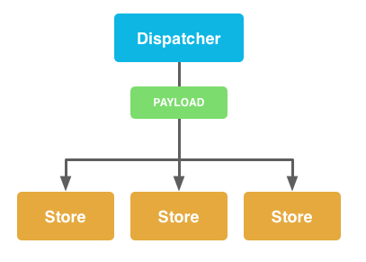

#Introduction

React.js Conf 2015 just ended and your excited as ever to start using React.js, but with only
a conceptual understanding of React and Flux - we have a lot to learn about
the asset pipeline, Flux,  and it's ecosystem.

Ultimately we want an example repository that is a straight forward and an ideomatic example
of creating a Flux application on Rails.

##Integrating Webpack

Webpack takes modules with dependencies and generates static assets representing those modules.
Its faster than gulp, and more powerful then browserify.  It rocks, and its time we start
using it instead of relying on crufty gemified javascript and file soup.

##Simple Rails setups

The hot-loader is awesome!  But in the spirit of simplification, you might want to
look at some other Rails-Webpack schemes.

* [Rails with Webpack - Why and How](https://reinteractive.net/posts/213-rails-with-webpack-why-and-how) - Oct 24, 2014 - SEBASTIAN PORTO <br>
Support multiple entry points, use Webpack watch and place bundled builds into app/assets/javascript.

* [Setting Up Webpack with Rails](https://medium.com/brigade-engineering/setting-up-webpack-with-rails-c62aea149679) - Aug 15, 2014 - Flarnie Marchan
Use a similar approach, also introduces Loaders and has [example repository](https://github.com/flarnie/webpack_rails_demo)


* [WEBPACK IN THE RAILS ASSET PIPELINE](http://www.tomdooner.com/2014/05/26/webpack.html) - May 26, 2014 - Tim Dooner
This snippet of code integrates Webpack into the Sprockets build process using tasks!

#Learning Flux

With just a basic understanding of Flux and React from watching:

* [Hacker Way: Rethinking Web App Development at Facebook](https://www.youtube.com/watch?v=nYkdrAPrdcw&list=PLb0IAmt7-GS188xDYE-u1ShQmFFGbrk0v#t=66) - May 4, 2014 - Facebook, Inc

I needed to read through [Facebook's documentation](https://facebook.github.io/flux/docs/overview.html#content) and scan the web to
take away some key understandings on how exactly to code a Flux application


From [Facebook's Overview of Flux](http://facebook.github.io/flux/docs/overview.html#content)

##Understanding Actions

I think a key understanding of actions is that they are **NOT** functions or routines.  <u>Actions
are data.</u>

"When new data enters the system, whether through a person interacting with the application or through a web api call, that data is packaged into an <u>action</u> — **an object literal containing the new
fields of data and a specific action type**." [*Actions and the Dispatcher*, Facebook, Inc](http://facebook.github.io/flux/docs/actions-and-the-dispatcher.html#actions-and-action-creators)

####Action Types

ActionTypes are literal primitives that are stored as constants.  It appears to be a react convention
to use [keyMirror](https://github.com/STRML/keyMirror) which given input: {key1: val1, key2: val2} will produce
output {key1: key1, key2: key2}.

```javascript
/* script/constants/AppConstants.js */

var keyMirror = require('react/lib/keyMirror');

module.exports = {
  ActionTypes: keyMirror({
    LOAD_STORIES: null,
    RECEIVE_STORIES: null,
    LOAD_STORY: null,
    RECEIVE_STORY: null,
    CREATE_STORY: null,
    RECEIVE_CREATED_STORY: null
  })
}
```


####Actions

An action is an object literal with an action type and parameters.

```javascript
{
      type: ActionTypes.CREATE_STORY,
      title: title,
      body: body
}
```

####Action Creators

Action creators build action data and pass them to the dispatcher.

```javascript
/* scripts/actions/StoryActionsCreator.js */

var AppDispatcher = require('../dispatcher/AppDispatcher.js');
var AppConstants = require('../constants/AppConstants.js');

var ActionTypes = AppConstants.ActionTypes;

module.exports = {

  createStory: function(title, body) {
    AppDispatcher.handleViewAction({
      type: ActionTypes.CREATE_STORY,
      title: title,
      body: body
    });
  }
}
```

##Understanding the Single Dispatcher

A key point of the dispatcher is that it there is only ever **one** dispatcher.
It is basically the manager and traffic cop since it can protect against
circular dependencies and endless loops.

While you are free to write your own, you can get a robust dispatcher as available through
the [flux npm module](https://www.npmjs.com/package/flux).

In your application, you extend flux's dispatcher with handler methods that wrap
actions into a payload.  These handler methods are called by your Action Creators.


```javascript
/* scripts/dispatcher/AppDispatcher.js */

var Dispatcher = require('flux').Dispatcher;
var assign = require('object-assign');

var AppDispatcher = assign({}, Dispatcher.prototype, {

  handleAction: function(action) {
    var payload = {
      action: action
    };
    this.dispatch(payload);
  }

});

module.exports = AppDispatcher;
```
Note: A [influential flux example](https://github.com/facebook/flux/blob/master/examples/flux-chat/js/dispatcher/ChatAppDispatcher.js)
defines both a handleServerAction and handleViewAction in the dispatcher and adds a source
attribute to the payload.  But [Flux author clarifies on stackoverflow that this is not needed](http://stackoverflow.com/a/26164414/143725)
I have a pending question on stack overflow if wrapping the action in payload is even necessary.

Our method (hanndleAction) calls the dispatch method, which will broadcast the action payload to all of its
registered stores. The stores will receive this action data and use its own logic
 to update its inernal state.



##Understanding Stores

Stores are application state and logic.  Unlike the dispatcher there isn't any library to lean on
within flux to do our work for us.  Fortunately, this means there is very little outside of our
code we need to understand; but we do need to stay true to store philosophies while programming a
store module.  We will also need to understand how to map our problem domain to stores.  While
similar to the M in MVC they aren't exactly models or collections, necessarily.

##Programming a Store Module

To code a Flux store into a javascript module we will need to code the following:

* **Protect State** - Define setter methods and declare variables in the module but do **not export** them.

* **Register with the Dispatcher** - Register a callback with the dispatcher to inspect payloads and call private setter methods with action data.

* **Define and Export an Event Emitting Store** - Define the Store that extends an Event Emitter and has **read accessors** to protected state.

This is the general layout, in the following sections we will discuss each section in detail.

```javascript
/* script/stores/ShoeStore.js */

var AppDispatcher = require('../dispatcher/AppDispatcher');
var ShoeConstants = require('../constants/ShoeConstants');
var EventEmitter = require('events').EventEmitter;
var merge = require('react/lib/merge');

// Protect State
var _shoes = {};

function loadShoes(data) {
  _shoes = data.shoes;
}

// Register with the Dispatcher
AppDispatcher.register(function(payload) {
  var action = payload.action;
  var text;
  // Define what to do for certain actions
  switch(action.actionType) {
    case ShoeConstants.LOAD_SHOES:
      // Call internal method based upon dispatched action
      loadShoes(action.data);
      break;

    default:
      return true;
  }

// Define and Export an Event Emitting Store
var ShoeStore = merge(EventEmitter.prototype, {

  // Returns all shoes
  getShoes: function() {
    return _shoes;
  },

  emitChange: function() {
    this.emit('change');
  },

  addChangeListener: function(callback) {
    this.on('change', callback);
  },

  removeChangeListener: function(callback) {
    this.removeListener('change', callback);
  }

});

module.exports = ShoeStore;

```


####Protect State

Stores insure only they can update state by declaring their state in variables inside the
module but outside of exported Store.

Notice these conventions of State Protection

1.  _shoes is declared outside of the ShoeStore
2.  loadShoes is declared outside the ShoeStore
4.  ShoeStore is the only thing exported (and doesn't itself offer any setters for _shoes)

```javascript
// Protect State
var _shoes = {};

function loadShoes(data) {
  _shoes = data.shoes;
}
```


####Registering With the Dispatcher

Outside of the Store, but within the module; you register with the dispatcher
to handle the payload.  The callback should:

1. switch on the action type
2. call the internal method that updates the protected state

```javascript
// Register with the Dispatcher
AppDispatcher.register(function(payload) {
  var action = payload.action;
  var text;
  // Define what to do for certain actions
  switch(action.actionType) {
    case ShoeConstants.LOAD_SHOES:
      // Call internal method based upon dispatched action
      loadShoes(action.data);
      break;

    default:
      return true;
  }
```


####Define and Export an Event Emitting Store

Since we extend from EventEmitter we easily manage listeners and execute their callbacks.  Here we declare
the API we provide to our Views so they can register themselves as listeners and access
state.

```javascript
// Define and Export an Event Emitting Store
var ShoeStore = merge(EventEmitter.prototype, {

  // Returns all shoes
  getShoes: function() {
    return _shoes;
  },

  emitChange: function() {
    this.emit('change');
  },

  addChangeListener: function(callback) {
    this.on('change', callback);
  },

  removeChangeListener: function(callback) {
    this.removeListener('change', callback);
  }

});

module.exports = ShoeStore;
```

##View Components

https://reactjsnews.com/react-style-guide-patterns-i-like/

#Adopting Flux Strategies

* How do we map Rails models to Flux Stores?

* How do we interact with async web requests?

* This seems like a lot of boilerplate and a little nebulous, are there any libraries?

##Map Rails models to Flux Stores

Most generally speaking, stores are application state and logic.  However, in hooking up
our Rails application to Flux, there are some basic questions to ask about designing stores for
relational data.

One approach is to have a store for each type of relational data.  This strategy suggests that
stores [can benefit from being normalized](https://groups.google.com/d/msg/reactjs/Rn39oRbABeo/B-45py2PBucJ).

It is perfectly fine for one store to depend on the data from another store.  In
fact, the dispatcher supports this with the waitFor API.

Bill Fisher (Software Engineer at Facebook) writes in a his [Stack Overflow Answer](http://stackoverflow.com/a/25708499/143725)
that the preferred way to join the data is in the store and not the components.

Given the following data

```javascript
/* ArticleStore._articles */
{
  '10': {id: 10, body: 'Lorem Ipsum Dolar ...', author: 1, reviewer: 2}
}

/* UserStore._users */,
{
  '1': {id: 1, name: 'user1'},
  '2': {id: 2, name: 'user2'}
}
```

To achieve the waitFor functionality the user store would capture a dispatchToken when
it registered with the dispatcher.

```javascript
  UserStore.dispatchToken = AppDispatcher.register(function(payload) {
    /* ... */
  });
```

And then from within the ArticleStore callback we can wait for the UserStore to
process the action before we proceed:

```javascript
 ArticleStore.dispatchToken = AppDispatcher.register(function(payload) {
    if (payload.actionType === 'foobar') {
      AppDispatcher.waitFor([UserStore.dispatchToken]);
      /* ... */
    }
  });
```

If we are careful to inform our dispatcher the sequence requirements, we can be
assured that the users data will be updated and usable:

```javascript
var ArticleStore = merge(EventEmitter.prototype, {
  function getArticles() {
    users = UserStore.getUsers()
    return joinArticlesWith(users); // custom routine to join/denormalize data
  },
 });
```


If a store depends on data from other stores, it can wait for those stores to
finish handling the currently dispatched action with the waitFor method.


##Handling Asynchronous Requests

It is not precisely intuitive in Flux where to handle asynchronous requests. This could be considered
a Flux design pattern question, but general consensus from engineers at
Facebook suggest that asynchronous requests actually do **not** belong in Stores,
but in Action Creators.

David Change writes in [The State of Flux](https://reactjsnews.com/the-state-of-flux/):  I think it is favorable to handle asynchronous requests in actions rather
than stores because:

1. It is a more consistent pattern to how data flows through the rest of the system

2. Multiple stores could be interested in listening to the success or failure of
 a request (such as a generic error handler store), and you typically don’t
 want to invoke actions from directly within your stores


Getting the data from the database and running the method isomorphicly another issue.

##Adopting a Flux Library

When people talk about Flux they mean more of a pattern than a framework. But Javascript community has already made a solid input into it and developed different approaches for working with Flux in order to bring some structure and “frameworky” feel. The first thing which comes to mind after some exploration - **there are too much Flux libraries right now**.

Comparisons

* [The State of Flux](https://reactjsnews.com/the-state-of-flux/) - Nov 6th 2014 - David Chang compares 6 Flux Frameworks.

* [Flux solutions compared by example](http://pixelhunter.me/post/110248593059/flux-solutions-compared-by-example) - Feb 7th, 2015 - Dmitri Voronianski takes a post-react-conference look at flux frameworks and maintains a [github repot of examples](https://github.com/voronianski/flux-comparison)

The contenders

* [Flux official site](http://facebook.github.io/flux/)
* [Facebook's Flux - Application Architecture for Building User Interfaces](https://github.com/facebook/flux)
* [fluxxor - A set of tools to facilitate building JavaScript data layers using the Flux](http://fluxxor.com/)
* [refluxjs - A simple library for uni-directional dataflow application architecture inspired by Flux](https://github.com/spoike/refluxjs)
* [barracks - Event dispatcher for the React Flux architecture](https://github.com/yoshuawuyts/barracks)
* [mcfly - A lightweight flux library with factories for Actions & Stores](https://github.com/kenwheeler/mcfly)
* [delorean - A completely agnostic JavaScript framework to apply Flux concepts](http://deloreanjs.com/)
* [marty - A library for make it easy build isomorphic flux applications with React](http://martyjs.org/)
* [dispatchr - A Flux dispatcher for applications that run on the server and the client](https://github.com/yahoo/dispatchr)
* [fetchr - Augments Flux applications by allowing the same syntax on server/client](https://github.com/yahoo/fetchr)
* [flux-router-component - Router React mixin for applications built with Flux](https://github.com/yahoo/flux-router-component)
* [fluxy - An implementation of Facebook's Flux architecture](https://github.com/jmreidy/fluxy)
* [normalizr — Normalizes nested JSON according to schema for Flux Stores](https://github.com/gaearon/normalizr)
* [Flummox - An isomorphic Flux library with zero singletons](https://github.com/acdlite/flummox)
* [Alt - A flux implementation that is small, tested, terse, and meant to be used with ES6](https://github.com/goatslacker/alt)
* [Tuxx - A feature-complete framework built on React and Flux.](https://github.com/TuxedoJS/TuxedoJS)

#Digging into Flummox

Idiomatic, modular, testable, isomorphic Flux. No singletons required.

##Flummox Actions

I love the way Flummox has you define action creators!  Actions are "wrapped" upon instantiation. When you fire an action, the return value isn't sent to the caller, but instead to the dispatcher. In other words, calling an action always returns undefined (or if the action is asynchronous, a promise that resolves to undefined — more below). This may seem weird, but it's designed this way to enforce unidirectional data flow. If this absolutely doesn't work for you, you can always use a helper function that calls the action internally while also returning a value to the original caller — just know this is an anti-pattern.

This makes Flummox Actions:

* Terse but not magical

* Opinionated: Unidirectionalism enforced

* Async Intelligent

```javascript
/* Flummox Action Example */

class MessageActions extends Actions {

  // Methods on the prototype are automatically converted into actions
  newMessage(content) {

    // The return value from the action is sent to the dispatcher.
    // To enforce unidirectional data flow, it is *not* returned to the caller.
    return content;
  }

  // Asynchrong nous functions are also supported: just return a promise
  // This is easy using async-await
  async createMessage(messageContent) {
    try {
      return await serverCreateMessage(messageContent);
    } catch (error) {
      // handle error somehow
    }
  }

}
```

Alt is a little too terse for my taste.

```javascript
/* Alt Action Example */

class ActionsCreators {
    constructor() {
        this.generateActions(
            'receiveProducts',
            'addToCart',
            'finishCheckout'
        );
    }

    cartCheckout(products) {
        this.dispatch(products);
        WebAPIUtils.checkoutProducts(products);
    }
}
```

I'm not quite sure what Tuxx is doing?

```javascript
/* Tuxx Action Example*/

    var Actions = require('tuxx/Actions');

    var todoActions = Actions.createActionCategory({
      category: 'todos',
      source: 'todo views',
      actions: ['add', 'remove']
    });

/* */

```

Look at the verbosity and boilerplate of marty

```javascript
/* Marty Action Example */

var CartActionCreators = Marty.createActionCreators({
    types: {
        addToCart: CartConstants.ADD_TO_CART,
        cartCheckout: CartConstants.CART_CHECKOUT
    },

    addToCart: function (product) {
        this.dispatch(product);
    },

    cartCheckout: function (products) {
        this.dispatch(products);
        ShopAPI.checkoutProducts(products);
    }
});
```

##Flummox Store

I'm not knowledgeable to understand if Flummox's approach to Store's is superior to the other frameworks, but
 I certainly like not dealing with Constants and big switch-case statements.  There seems to be a buzz about
 immutability, and the Flummox Store has some opinions there!  My gut says this is good.

* No Constants

* No big switch-case statements

* Opinionated

* Removes addListener() and removeListener() boilerplate

```javascript
class MessageStore extends Store {

  // Note that passing a flux instance to the constructor is not required;
  // we do it here so we have access to any action ids we're interested in.
  constructor(flux) {

    // Don't forget to call the super constructor
    super();

    // Register handlers with the dispatcher using action ids, or the
    // actions themselves
    let messageActions = flux.getActions('messages');
    this.register(messageActions.newMessage, this.handleNewMessage);

    // Set initial state using assignment
    this.state = {};
  }

  // Define handlers as methods...
  handleNewMessage() { ... }

  // It's also useful to define accessor-style methods that can be used by
  // your views on state changes
  getMessage(id) { ... }
}
```
## Flummox Criticism

I'm not terribly excited about packing and upacking store and actions via string keys.

```javascript
/* Packing Actions and Stores into flux using string keys */
export default class Flux extends Flummox {
    constructor() {
        super();
        this.createActions('app', Actions);
        this.createStore('products', ProductStore, this);
        this.createStore('cart', CartStore, this);
    }
}
```

```javascript
/* Unpacking with string keys */
let actionIds = flux.getActionIds('app');
this.productStore = flux.getStore('products');
```

# Digging into Alt

## Alt Actions

More explicit connection to dispatcher than flummox.  Similar to flummox it has no constants boilerplate.

```javascript
class LocationActions {
  updateLocation() {
    this.dispatch('Paris')
  }
}

var locationActions = alt.createActions(LocationActions)
```

Unlike flummox, the pattern seems to use actions directly instead of first packing them into a flux object
using string keys.

```javascript
locationActions.updateLocation()
```

Writing out actions that pass data through directly can get quite tedious so there's a shorthand for writing
 these what are essentially identity functions

```javascript
class LocationActions {
  constructor() {
    // for single action
    this.generateActions('updateLocation')

    // as well as for many actions
    this.generateActions('updateCity', 'updateState', 'updateCountry')
  }
}
```

##Alt Stores

A super terse alt.js feature bindActions.  This procedure binds every methodxyz in the action to onMethodxyz.
No constants, no case-soup, no need to re-iterate bindings.

```javascript
class LocationStore {
  constructor() {
    this.bindActions(locationActions)

    this.city = 'Denver'
    this.state = 'Colorado'
  }

  onUpdateLocation(obj) {
    var { city, state } = obj
    this.city = city
    this.state = state
  }

}

var locationStore = alt.createStore(LocationStore)
```

Stores are immutable, but accessible.  For example to get the city:

```javascript
locationStore.getState().city
```

Waitfor seems pretty easy

```javascript
this.waitFor([store1.dispatchToken, store2.dispatchToken])
```

##Alt Components

The alt.createStores gave them the ability to listen and unlisten.

```jsx
var LocationComponent = React.createClass({
  getInitialState() {
    return locationStore.getState()
  },

  componentWillMount() {
    locationStore.listen(this.onChange)
  },

  componentWillUnmount() {
    locationStore.unlisten(this.onChange)
  },

  onChange() {
    this.setState(this.getInitialState())
  },

  render() {
    return (
      <div>
        <p>
          City {this.state.city}
        </p>
        <p>
          State {this.state.state}
        </p>
      </div>
    )
  }
})
```
