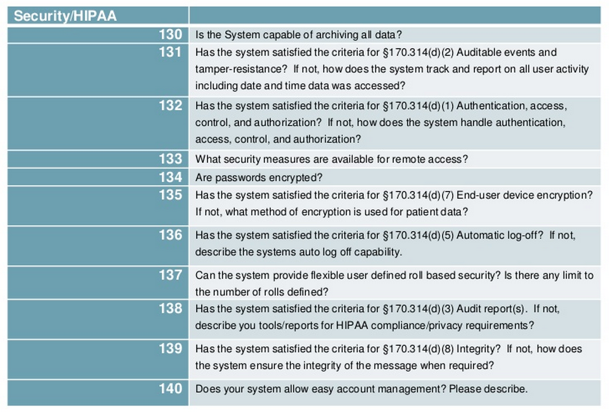

Introduction
------------

This article takes you along my stumble across the Internet as I explore Health Information Technology as starting from the research paper written March 2012 [Anatomical Pathology Laboratory Information Systems](http://www.researchgate.net/publication/221814086_Anatomic_pathology_laboratory_information_systems_A_review)

Interfaces
----------

Interfaces are connections that allow for interchange of data between otherwise incompatible systems.  LIS interfaces come in three broad varieties:

* Application interfaces

* Interface engines

* Instrument interfaces

Application interfaces are interfaces to another computer systems, most commonly a hospital's EMR.  In contrast, interface engines are an amalgamation of many application interfaces into one ... they reduce the complexity of the system by reducing the number of individual interfaces needed for multiple systems -- each system need only be interfaced to the interface engine.  [Anatomic pathology laboratory information systems: A review](http://www.researchgate.net/publication/221814086_Anatomic_pathology_laboratory_information_systems_A_review)

* [End User Device Encryption](http://www.healthit.gov/sites/default/files/standards-certification/2014-edition-draft-test-procedures/170-314-d-7-end-user-device-encryption-2014-test-procedures-draft-v-1.0.pdf)
