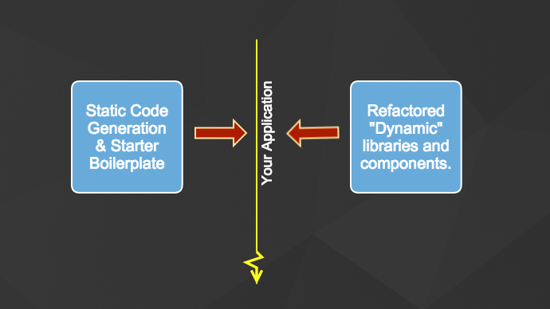

##Introduction

Have you ever used the --save option when you npm-install a package.  Of course you do!  Because regardless your stance on code generation, a modest amount of assistance rocks!  I tend to think of application writing as a balance between code generation (but not too much) and refactoring (but not too much).



I wish there was a golden rule to knowing the perfect amount of code generation and refactoring.  If you find one, please share.  But for now, lets say some code generation is good, its up to you to determine how much.  Now that were passed that; what is the best way to generate code!  

##An Index Pattern

Lets say I want to maintain an index of FooBars.  So that every time I create a FooBar it gets added to this index.js:

```javascript
import SmartFooBar from './SmartFoobar';
import SillyFooBar from './SillyFoobar';
import AwesomeFooBar from './AwesomeFoobar';

let foobars = {
  smart: SmartFooBar,
  silly: SillyFooBar,
  awesome: AwesomeFooBar
}

module.exports = foobars;
```

For me personally, keeping indexes has become a convenient pattern.  I only have to import the foobars index to get access to any foobar in my app.

```javascript
import foobars from '../Foobars/index.js';

foobars.silly.go()
```

## in-app-generator

Why would you want an in-app-generator?  Many reasons!  

First.  Avoid creating a product. Most people that I know that use code generation don't like developing their generators in a separate package and using NPM link.  This encourages them to "productize" their code generator and get distracted.  I feel that you should be encouraged to write throw-away generators that are as custom as your app itself.  No wonder javascript has a million "frameworks".  Every app specific generator is published.  They have little relevance to your project unless your just getting started and they made every exact choice you made.

Second.  In app generators can share your application's code.  This is a subtle, but important point.  A generator should be able to reflect on the shape and structure of your data and application to create meaningful scaffolds.  To do this reasonably, your app becomes part of the generator, the line is blurred - and thus you have an in-app-generator.

Last.  Thats the way Rails does it.  I've used Rails since 2005 and I've grown accustomed to maintaining custom generators for each project that make sense for the specific project.  I wanted it, so I made it.

## Why Yet Another Yo, Slush

Being in-app was important, and being in-app means that the CLI needed to be able to require ES6 (my app).  Not knowing how to make Yo or Slush do this, I figured it shouldn't be too hard to create my own generator.  What I discovered was that it wasn't hard.  And I learned a lot of cool things about Babel on the way.

#### Using Babel To Run ES6 Without Build

Luckily the in-app-generator CLI could use babel core to translate on-the-fly.  It really just took two lines of code.  Below is basically how in-app-generator (and babel-node) run ES6 on node.  The magic is in register.  Register changes how subsequent calls to require work.  After register, subsequent calls to require will transpile to ES5 on-the-fly.

```javascript
var babel = require('babel-core');
babel.register({stage: 0})
```

After this, all subsequent require's translate ES6/7 to ES5 on-the-fly.

## Using Babel For Code Injection

Babel

* Code GenI wanted to add an API to the in-app-generator to make things like maintaining an index.js (like above) ... really easy :).

Fun code generation begins and ends with babel.

https://github.com/babel/babel/blob/7905f482804017888dba820f23cec1d5656b39ff/src/babel/transformation/file/index.js
