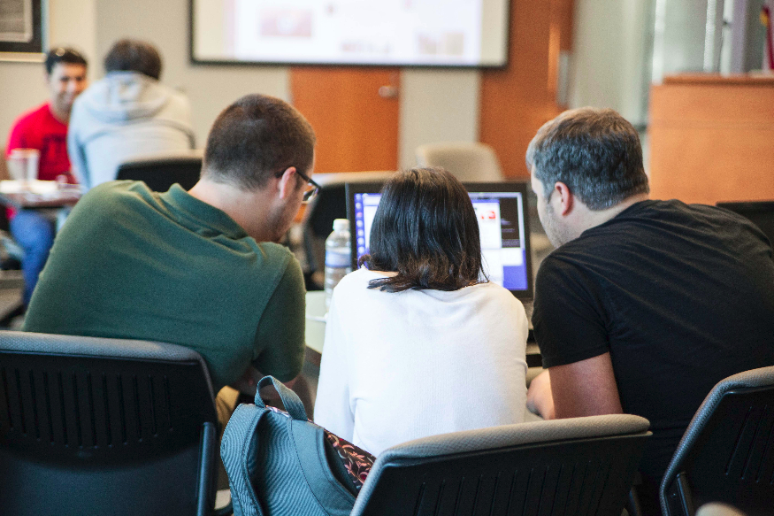
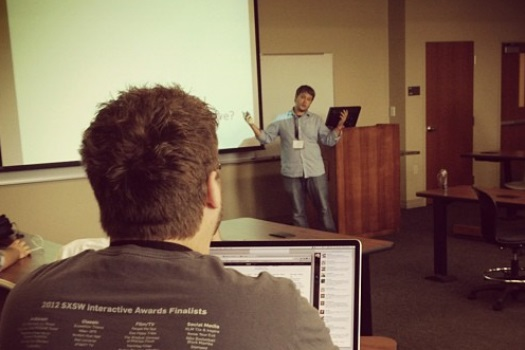
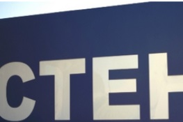
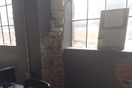
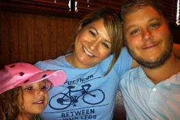

##Articles

2015/03/05 - [[Reapp Test Drive]]

2015/02/23 - [[Introduction to ES6]]

2015/02/07 - [[Getting Started with Flux on Rails]]

##About Me

I'm a developer who tweets at <a href="https://twitter.com/jrhicks">@jrhicks</a>.  I blog about things
I'm trying to learn.  I'm a practicing 4DX coach, family guy, and I enjoy chess, bicycling, and health topics.

I work at <a href="htttp://www.cteh.com">CTEH LLC</a> where I've been developing and maintaining a suite
of Ruby-On-Rails applications for Emergency Response Management and readyness.  These applications are not
public facing so I've attempted to collect my public works below.

###Hackathon Code

**3-Way-Like-Data-Binding for PouchDB in Angular**  
*2014/10/25*  
*ArkansasDev Hackathon 1.0*  
Hacked on and <a href="https://github.com/jrhicks/ngPouch">released an experimental ngPouch</a> with two UCA students who were networking in anticipation of college graduation.

###Public Presentations

**Javascript’s Build Ecosystem**  
*2014/07/26*  
*BarCamp Little Rock*  
Introduction to Bower, NPM, Grunt, Gulp, Yo and a live coding demonstration on how to use them together to build a gorgeous hybrid iPhone app and staticly generate a responsive website.

**OmniAuth in Rails**  
*2012/06/12*  
*Barcamp Conway*  
Using 3rd party authentication and data to deliver more value quickly.

###Open Source Projects

**In Production-Use Gems**

PageFor - Collection of skinable Rails Helpers for rendering User Interface Components and Layouts

PolyWag - Reduces controller boiler plate code without hidden side-effects

**Experiments**

Wikismith - A gulp static site generator that created this site.

## 4DX Coach

###At CTEH

Under executive guidance and professional consulting from Franklyn Covey, I'm part of small
coaching team that help 30+ teams execute consistently on their most important goals.

###Acorn Hours

I met with Acorn Hours CEO at barcamp Little Rock and helped him set his goals and leads.  A small
personal scoreboard was created after our 2nd meeting.

###Lawson And Company

I've met with with Lawson and Company 3 times to introduce 4DX and help them develop their
Lead and Lag Mesaures.  On the 3rd meeting they finalized their lead measures, crafted the
 best physical scoreboard I've ever seen - and practiced holding weekly WIG sessions.
session

##Family Guy

###Our Family

We live in Maumelle, Arkansas.  On weekends we like to grab lunch and enjoy the weather.

###Lili

This is Lili and me a few years ago at Seagrove Beach.  We've been together since the summer of 1999 and
still going strong.

###Ava

Our world revolves around Ava.  In this photo she is doing a cheer pose and is pretty excited about
casual-day at school.

## Hobbies

You can find me on Chess With Friends, riding my bike around the Little Rock river trail, or spouting off some diet trivia I've recently read.  I like to program to
[[Atmospheric Drum and Bass]]
