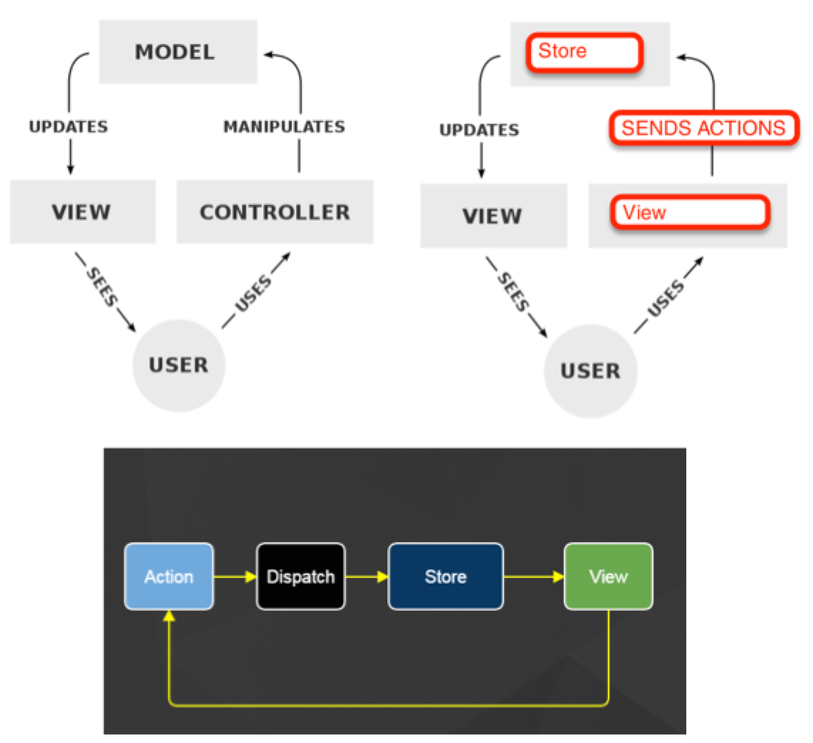

Objectives
=============

* Understand Flux

* Build TodoMVC using Flux

Understand Flux
=============

Facebook contends that modern MVC looks like this, I'm not 100% sure how a web app's MVC looks like this, but if it did they say that the bi-directional updates create "infinite loops".  Its difficult to trace in diagram, its even more difficult to trace in code.

## Facebook's Problem With Client Side MVC


## Server side MVC

As popularized by Rails.  Server side MVC is a scheme for separation of concerns / technologies as the we move from request to response.


## MVC 1988
Original MVC from Smalltalk80.  1988


## Flux is similar to MVC



## Flux basics

* An Action - Is Just DATA.  Yes data.  It typically contains some unique name or title to identify it, and some data that supports it.  Its almost like a web request in the sense that web requests have an url to identify them and parameters / form data.  Actions (unlike web requests) are client side.

* Dispatcher - The dispatcher is somewhat analogous to a web framework's router, except instead of invoking an entry point, it gives the action to EVERY SINGLE STORE in the app.  Every single store looks at the action and decides if and what it wants to do with the action.  Since the dispatcher takes care of giving all the stores the action, the views only need to dispatch the action and can be developed blissfully unaware of current or future stores.

* Store - The store is analogous to a model, except a single store may hold a collection of records, multiple collections of records, a single record, or a summary of records.  Its to constraining to think of them like with the of Object Relation Mappers in rails.

* View - Views are React components.  They listen to changes in certain stores and re-render themselves as needed from data in 1 or more stores.  React components can respond to user events by dispatching actions.

Flux Original
=====

## Actions

* An action is data.

* You write action creators.

* Action creators create the data and send it the dispatcher.

```
var TodoActions = {

  updateText: function(id, text) {
    AppDispatcher.dispatch({
      actionType: TodoConstants.TODO_UPDATE_TEXT,
      id: id,
      text: text
    });
  },

  destroy: function(id) {
  AppDispatcher.dispatch({
    actionType: TodoConstants.TODO_DESTROY,
    id: id
  });
}
```

## Dispatcher

* Sends the action to all stores that have registered with it.

* Only 1 dispatcher.

## Stores

* Register with the dispatcher.

* Inspect the action and decide whether and how to update its data.

* Emit Change

```
AppDispatcher.register(function(action) {
  var text;

  switch(action.actionType) {
    case TodoConstants.TODO_CREATE:
      text = action.text.trim();
      if (text !== '') {
        create(text);
        TodoStore.emitChange();
      }
      break;

    case TodoConstants.TODO_TOGGLE_COMPLETE_ALL:
      if (TodoStore.areAllComplete()) {
        updateAll({complete: false});
      } else {
        updateAll({complete: true});
      }
      TodoStore.emitChange();
      break;
```

## View

* These are React Components

* Components can populate the default state fromt he store

* When components mount, have them listen to emitted changes from the store

* When components unmount, have them stop

```
function getTodoState() {
  return {
    allTodos: TodoStore.getAll(),
    areAllComplete: TodoStore.areAllComplete()
  };
}

var TodoApp = React.createClass({

  getInitialState: function() {
    return getTodoState();
  },

  componentDidMount: function() {
    TodoStore.addChangeListener(this._onChange);
  },

  componentWillUnmount: function() {
    TodoStore.removeChangeListener(this._onChange);
  },

  /**
   * Event handler for 'change' events coming from the TodoStore
   */
  _onChange: function() {
    this.setState(getTodoState());
  }

  render: function() {
    /* Ommitted */
  }
```

Flux Ecosystem
====

Flux is a convention not a library.  Even the dispatcher which is a library isn't that hard to re-write.

* [Flux Comparison](https://github.com/voronianski/flux-comparison)

* [Adopting a Flux Library](/getting_started_with_flux_on_rails/index.html#md-adopting-a-flux-library)

Build TodoMVC using Flux
=====

* git clone https://github.com/arkency/react_flux_alt_immutable_todolist

* cd flux_alt_immutable_todolist

* grunt build

* grunt serve

## Review code base

* Form responds to input

* Todo items respond

## Clippy

Time magazine named Clippy one of the 50 worst inventions.  Sounds like a  good idea.


```
import ImmutableStore from 'alt/utils/ImmutableUtil';
import AltInstance    from 'lib/AltInstance';
import Actions        from 'actions/TodoList';

class ClippyStore {
  constructor() {
    let { addTask, removeTask } = Actions;

    this.bindListeners({
      add: addTask,
      remove: removeTask
    });

    this.state = "Hello :)";
  }

  add(task) {
    console.log("Got It! Task noted.");
    return this.setState("Got it!  Task noted.");
  }

  remove(taskID) {
    return this.setState("Awesome!");
  }
}

export default AltInstance.createStore(ImmutableStore(ClippyStore));
```

## Clippy View

* Create class -vs- ES6 Classes

```
import React from 'react/addons';
import { Alert } from 'react-bootstrap';
import ClippyStore from 'stores/Clippy';

class Clippy extends React.Component {
  constructor(props) {
    super(props);

    this.state = { message: ClippyStore.getState() };
    this.onChange = this.onChange.bind(this);
  }

  componentDidMount()    { ClippyStore.listen(this.onChange); }
  componentWillUnmount() { ClippyStore.unlisten(this.onChange); }

  onChange()  { this.setState({ message: ClippyStore.getState() }); }

  render() {
    return (
      <Alert> {this.state.message} </Alert>
    );
  }
}

export default Clippy;
```
