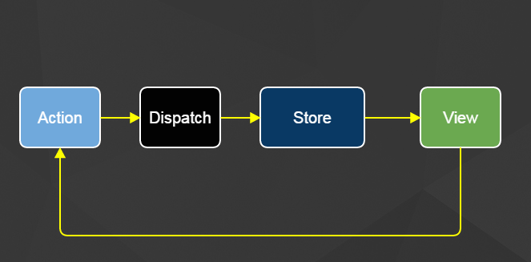
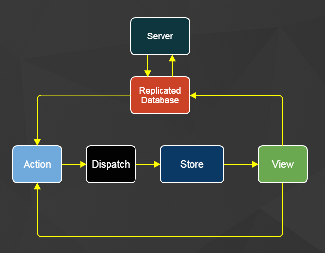

#Introduction#

In [my last post](/client_side_routing_notes/index.html), navigating **data space** was proposed as one of a few concerns of client side routing and the following architectures were investigated:

* Dan Abramov's [Content Stores Pattern](/client_side_routing_notes/index.html#md-content-stores)

* Facebook's [Relay Architecture](/client_side_routing_notes/index.html#md-relay-and-graphql)

* A Home Brewed [Offline Partitions Store](/client_side_routing_notes/index.html#md-offline-partitions-store)

In this article I recap these patterns quickly, introduce a new pattern called Full Stack Flux, and I refine the design of a newly proposed pattern that draws on qualities of each of these, but favors High Availability with Eventual Consistency.

#Content Stores Pattern#



**Dan Abramov's [Content Stores](/client_side_routing_notes/index.html#md-content-stores) approach is pure flux!**  We have a content store for each entity type.  Server actions dispatch to all stores, the stores inspect the response and harvest any data that pertains to them.  The views listen to stores and render as needed.


#Relay Architecture#

**Facebook's Relay approach is pure decoupling!**  Statically declare the data needs of a component within itself.  Eliminate creating and *maintaining* custom server end-points that match the needs of each component (and subcomponent) on the page.


#Full Stack Flux#

[Elie Rotenberg](https://twitter.com/elierotenberg) who writes about [Million User Webchat](https://blog.rotenberg.io/million-user-webchat-with-full-stack-flux-react-redis-and-postgresql/) has an awesome FLUX pattern for __Single Source Of Truth__.  Even more interesting to me is the replacement of the dispatcher with PGSQL notifications.


It goes through a lot of layers to get there, but the client component essentially updates the world by talking to
the database.  This looks a little like updating shared-mutable-state, but I think this architecture shows that writing to a database (that notifies and dispatches) is different than writing to
shared mutable state.

#High Availability Eventually Consistent Flux#

I liked the pure flux of Dan's approach, the pure decoupling of Relay, and the database-as-a-notifier approach of Full Stack Flux PGSQL.  How could I combine all these ideas, into an architecture that relaxed the importance of __Single Source Of Truth__ in favor of higher availability and eventual consistency.



##Similarities to Full Stack Flux##

It looks like the view is accessing shared mutable state by writing to the replicated database, but much like the Full Stack Flux example, we are actually
going to enforce single direction data flow and simply use the database as
an event emitter.  With a high availability pattern, we can assume a large amount of data will be on our potentially offline devices, and we want to keep
performance by leaning on the database's capabilities.  Different from Full Stack
Flux, I've removed the layers between the view and the database so they can work
offline.

##Similarities to Content Stores##

Much like Content Stores, the Replicated Database implements a collection for each
different entity type and data is normalized.  The unidirectionality is preserved.  Shared mutable state appears to be violated in this pattern, but I propose that writing to a database (that emits events to actions) maintains immutability.  For performance gains I propose that views can read from the database, but only in reaction to stores and constrained!

##Similarities to Relay##

The replicated database only replicates subsets of the data on the server, these subsets are requested by the views when components mount.  Similar to Relay, the components control what data is fetched!  In this example we get the projectId from the router and tell the replicated database to include the notes and contacts for this project.

Relay provides composable GQL.  This pattern uses many subscriptions that act
as basic filters to restrict the replicated data.

```
componentWillMount() {
  let projectId = parseInt(this.getParams().projectId);
  ReplicatedDatabase.addSubscription('note', {project_id: projectId} );
  ReplicatedDatabase.addSubscription('contact', {project_id: projectId} );
},
```

All the data is fetched by the ReplicatedDatabase and stored normalized into an in-memory database with persistence options.  The replicated database can syndicate its changes to actions, and from there we follow the traditional flux pattern.

Similar to Relay, your server can have one generic server end point!  Which is awesome!  But you don't need GQL magic on the server, here is a basic implementation in Rails:

```ruby
#SERVER

class OfflineController < ApplicationController
  def download_updated()
    scope = JSON.parse(params[:scope])
    collection = scope[:collection]
    filter = scope[:filter]

    # Get ActiveRecord Class For Requested Entity From String
    m = collection.camelize.constantize

    if scope[:lastUpdatedCursor]
      ci = scope[:lastIdCursor]
      cu = DateTime.parse(scope[:lastUpdatedCursor])
      data = m.where(filter)
              .where(["updated_at > ? or (updated_at=? and id>?)", cu, cu, ci])
              .order("updated_at asc, id asc")
              .limit(250)
    else
      data = m.where(filter)
              .order("updated_at asc, id asc")
              .limit(250)
    end
    render text: data.to_json
  end
end
```

Here is the front end code in the Replicated database

```
// REPLICATED DATABASE

import agent from 'superagent-promise';

async downloadUpdatesFor(subscription) {
  let i = subscription.lastIdCursor;
  let d = subscription.lastUpdatedCursor;
  do {
    let scope = {
                  collection: subscription.collection,
                  filter: subscription.filter,
                  lastIdCursor: i,
                  lastUpdatedCursor: d
                };
    let scopeJson = encodeURIComponent(JSON.stringify(scope));
    let url = `/offline/download_updated?scope=${scopeJson}`;
    let response = await agent.get(url).end();
    let data = JSON.parse(response.text);
    await loadData(subscription, data);
    let lastItem = data[data.length - 1];
    if (lastItem) {
      i = lastItem.id;
      d = lastItem.updated_at;
    }
  } while (data.length > 0)
}
```

Using [LokiJS](http://lokijs.org/) for storing the data.  Handling server updates would look something like:

```
for (let serverRecord of data) {
  let localRecord = collection.findOne({id: serverRecord.id});
  if (localRecord) {
    # TODO
  }
  else {
    collection.insert(serverRecord);
    subscription.recordsDownloaded += 1;
    subscription.save
  }
}
```

##Performance##

I use this basic insertion algorithm to sync 10,000 records.  Here is how it performs:

<iframe width="560" height="315" src="https://www.youtube.com/embed/cuN3tyuMED8" frameborder="0" allowfullscreen></iframe>

##Example Repository##

You can checkout the full project here https://github.com/jrhicks/LokiJS-Flux-Example

git clone https://github.com/jrhicks/LokiJS-Flux-Example.git

cd LokiJS-Flux-Example

bundle install

rake db:setup

npm install

foreman start

open http://localhost:3000
